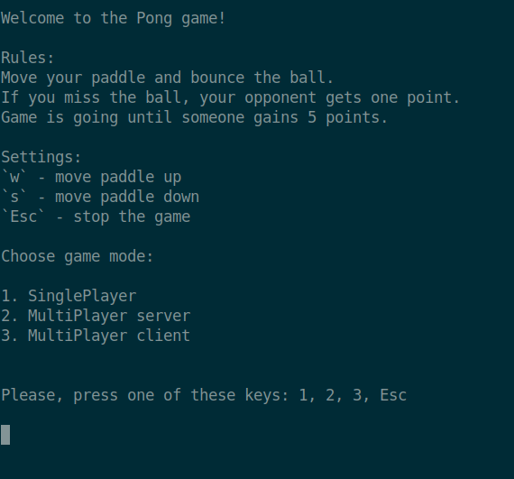

# Pong
Console version of the Pong game.

Has two game modes:
1. Single-player with simple AI
2. Two-player over TCP socket

# Prerequisites
Installed Java(8 or higher) and [sbt](https://www.scala-sbt.org/index.html)

# Running
```
git clone https://github.com/susliko/Pong/
cd Pong/
sbt assembly
java -jar ./target/scala-2.13/pong.jar
```

# Demo
<p align="center">
  
</p>

<p align="center">
  
</p>
